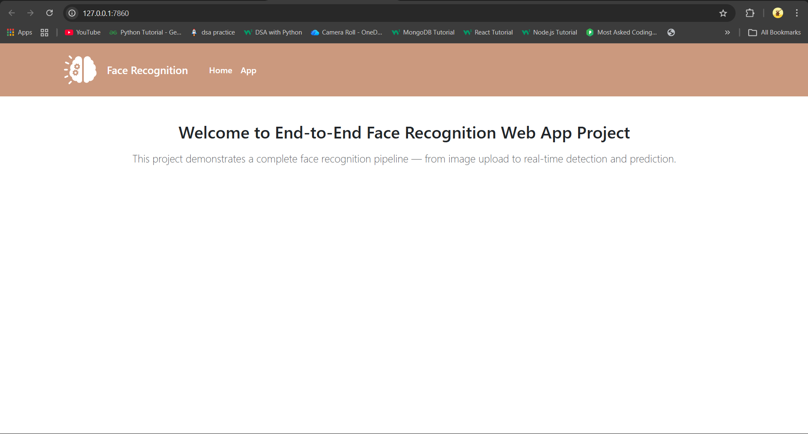
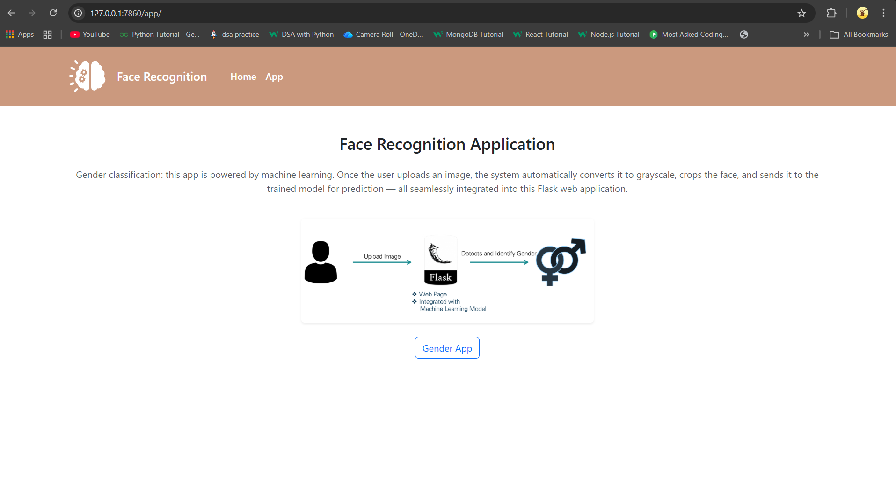
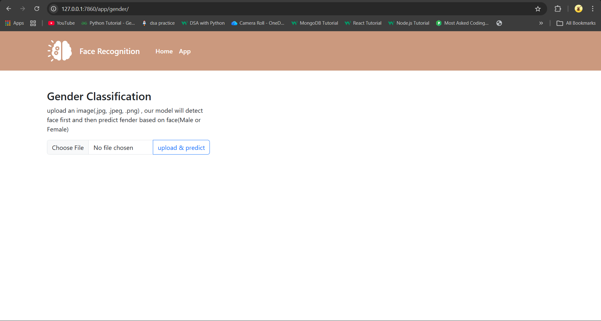
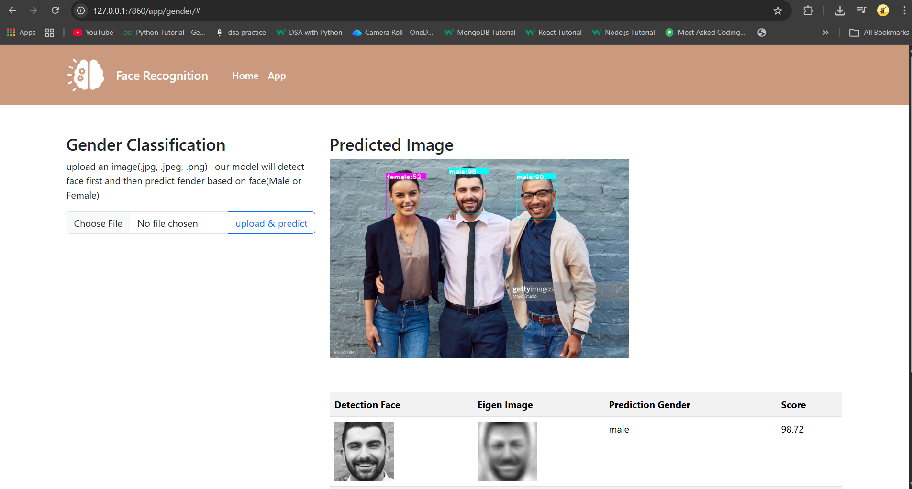

# 🧠 Face Gender Recognition using PCA + SVM (Flask Web App)

This project is a **Face Gender Recognition System** that detects faces from images and predicts gender using Computer Vision and Machine Learning techniques.

The system integrates:

- Haar Cascade → Face Detection  
- PCA (Eigen Faces) → Feature Extraction  
- SVM → Gender Classification  
- Flask → Web Application Interface  

---

## 🚀 Features

✅ Detect faces from uploaded images  
✅ Normalize and preprocess facial data  
✅ Extract facial features using PCA  
✅ Predict gender using SVM classifier  
✅ Displays prediction confidence score  
✅ Supports multiple faces detection  
✅ User-friendly Flask UI  

---

## 🛠️ Tech Stack

- Python
- OpenCV
- NumPy
- Scikit-learn
- Flask
- Pickle (Model Serialization)

---

## 📂 Project Structure

```
project-folder/
│
├── app/
│   ├── views.py
│   └── templates/
│
├── model/
│   ├── haarcascade_frontalface_default.xml
│   ├── model_svm.pickle
│   └── pca_dict.pickle
│
├── screenshots/
│   ├── input1.jpg
│   ├── output1.jpg
│   └── output_multiple.jpg
│
├── app.py
├── requirements.txt
└── README.md
```

---

## ⚙️ Working Pipeline

```
Input Image
     ↓
Face Detection (Haar Cascade)
     ↓
Grayscale Conversion
     ↓
Normalization & Resizing
     ↓
PCA Feature Extraction (Eigen Faces)
     ↓
SVM Classification
     ↓
Gender Prediction Output
```

---

## 📦 Installation

### 1️⃣ Clone Repository

```
git clone (https://github.com/sankar58/faceRecognitionProject)
```

---

### 2️⃣ Create Virtual Environment

```
python -m venv venv
```

Activate environment:

Windows
```
venv\Scripts\activate
```

Linux / Mac
```
source venv/bin/activate
```

---

### 3️⃣ Install Dependencies

```
pip install -r requirements.txt
```

---

## ▶️ Run Application

```
python main.py
```

Open browser:

```
http://127.0.0.1:5000/
```

---

## 🖼️ Application Demo

### 🔹 Home Page



---

### 🔹 Application Overview Page



---

### 🔹 Image Upload Interface



---

### 🔹 Gender Prediction Output



---
## 📊 Model Details

| Component | Algorithm |
|------------|-------------|
| Face Detection | Haar Cascade |
| Feature Extraction | PCA |
| Classification | Support Vector Machine |

---

## 📁 Model Files

- `model_svm.pickle` → Trained SVM Model  
- `pca_dict.pickle` → PCA Model + Mean Face  
- `haarcascade_frontalface_default.xml` → Face Detection Model  

---

## 🌐 API Endpoints

| Endpoint | Method | Description |
|------------|------------|-------------|
| `/` | GET | Home Page |
| `/app/` | GET | Application UI |
| `/app/gender/` | GET, POST | Gender Prediction |

---


## 🛑 Limitations

- Works best with frontal faces  
- Sensitive to lighting conditions  
- Binary gender classification only  
- Accuracy depends on dataset quality  

---

## 🔮 Future Improvements

- Integrate Deep Learning Models (CNN / Transfer Learning)
- Add Age Prediction
- Real-Time Webcam Detection
- Improve Dataset Diversity
- Docker Deployment
- Cloud Hosting


## 👨‍💻 Author

**Sankar A**

Interests:

- Artificial Intelligence  
- Machine Learning  
- Computer Vision  
- Full Stack Development  

---

## ⭐ Contribution

Pull requests are welcome. For major changes, open an issue first.

---

## 📜 License

MIT License
